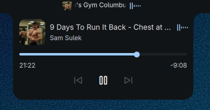

# Dynamic Island

Dynamic Island like plugin for Noctalia.



## Features

- **Compact view**: Shows album art, track title, and audio visualizer in the bar
- **Morphing animation**: Smoothly expands into a full media panel when clicked
- **Media controls**: Play/pause, skip tracks, and draggable progress bar
- **Audio visualizer**: Spring physics visualizer using spectrum analysis
- **Configurable**: Width, auto-hide delay, title scrolling, and visualizer toggle

## Installation

1. Install via Noctalia's plugin manager (recommended)
2. Or manually clone to `~/.config/noctalia/plugins/dynamic-island/`
3. Enable in Settings → Plugins
4. Add to bar in Settings → Bar → Center section

## Usage

Click the compact island in the bar to expand the full media panel with playback controls, progress bar, and album art.

Right-click the widget to access settings __broken__.

## CLI Commands

Control playback via IPC:

```bash
qs ipc call plugin:dynamic-island toggle      # Toggle panel
qs ipc call plugin:dynamic-island playPause   # Play/pause
qs ipc call plugin:dynamic-island next          # Next track
qs ipc call plugin:dynamic-island previous     # Previous track
```

## Settings

| Setting | Default | Description |
|---------|---------|-------------|
| compactWidth | 180 | Width of the island in compact mode (120-280) |
| clearDelay | 3000 | Auto-hide delay in milliseconds (1000-10000) |
| scrollTitle | true | Enable scrolling for long track titles |
| showVisualizer | true | Show audio visualizer bars when playing |

## Requirements

- Noctalia Shell 4.4.1+
- Media service must be enabled

## License

MIT

## Credits

- Inspired by Apple's Dynamic Island
- Built for [Noctalia](https://github.com/noctalia-dev/noctalia)
